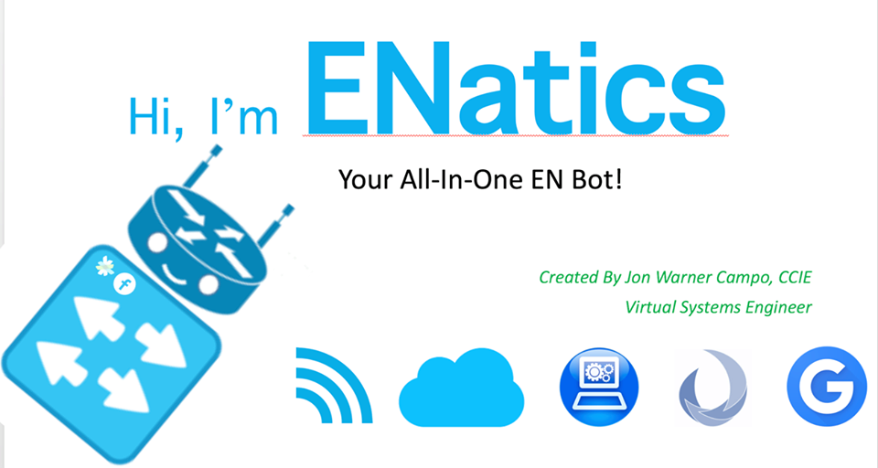

{\rtf1\ansi\ansicpg1252\cocoartf1504\cocoasubrtf830
{\fonttbl\f0\fmodern\fcharset0 Courier;}
{\colortbl;\red255\green255\blue255;\red0\green0\blue0;\red0\green0\blue0;}
{\*\expandedcolortbl;;\cssrgb\c0\c0\c0;\cssrgb\c0\c0\c0;}
\margl1440\margr1440\vieww24240\viewh13800\viewkind0
\deftab720
\pard\pardeftab720\sl280\partightenfactor0

\f0\fs24 \cf2 \expnd0\expndtw0\kerning0
\outl0\strokewidth0 \strokec2 # Hi, I\'92m ENatics\
\
\
Your All-In-One EN Bot!\
\
\
\
Table of Contents\
=================\
\
   * [ENatics](#enatics)\
   * [Table of Contents](#table-of-contents)\
      * [Features](#features)\
      * [Quick Usage](#quick-usage)\
      * [Installation Guide](#installation-guide)\
\pard\pardeftab720\sl280\partightenfactor0
\cf3 \outl0\strokewidth0 	* [Demo](#demo)\cf2 \outl0\strokewidth0 \strokec2 \
\pard\pardeftab720\sl280\partightenfactor0
\cf2 \
Created by [{\field{\*\fldinst{HYPERLINK "https://github.com/joncampo"}}{\fldrslt https://github.com/joncampo}}]\
\
## Features\
\
\pard\pardeftab720\sl280\partightenfactor0
\cf3 \outl0\strokewidth0 \
\cf2 \outl0\strokewidth0 \strokec2 \
\pard\pardeftab720\sl280\partightenfactor0
\cf2 ## Quick Usage\
\
\pard\pardeftab720\sl280\partightenfactor0
\cf3 \outl0\strokewidth0 \cf2 \outl0\strokewidth0 \strokec2 \
\pard\pardeftab720\sl280\partightenfactor0
\cf2 \
\
## Installation Guide\
\
1. Download or clone ENatics\
2. Edit Settings.py and enter Platform IP Addresses and user/pass.\
	a. For Spark bot, enter App ID from here - \
	b. For Facebook bot, enter App ID from here - \
3. Install the modules/libraries from requirements.txt\
4. Install Heroku Tools\
5. Create Heroku App\
6. Deploy using Heroku procedure below:\
	a. git add .\
	b. git commit -m "Update"\
	c. git push heroku master\
\
\
## Demo\
\
\
\
Note: By using this module, you agree to Terms of Service -  and Privacy Policy - \
\
}